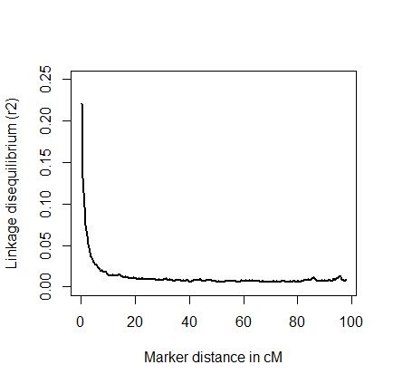
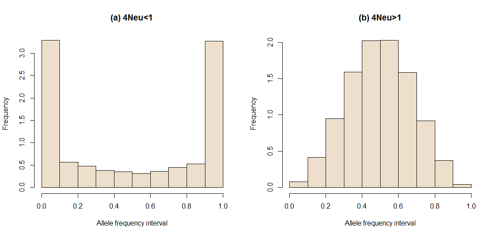
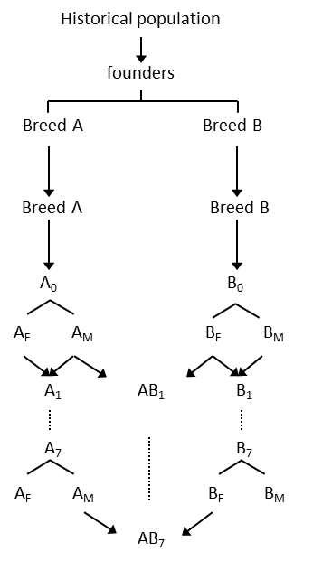
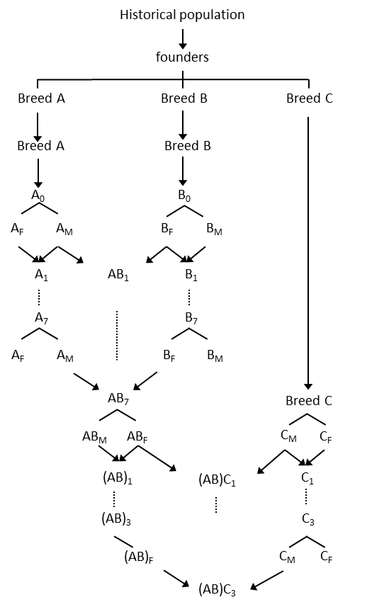
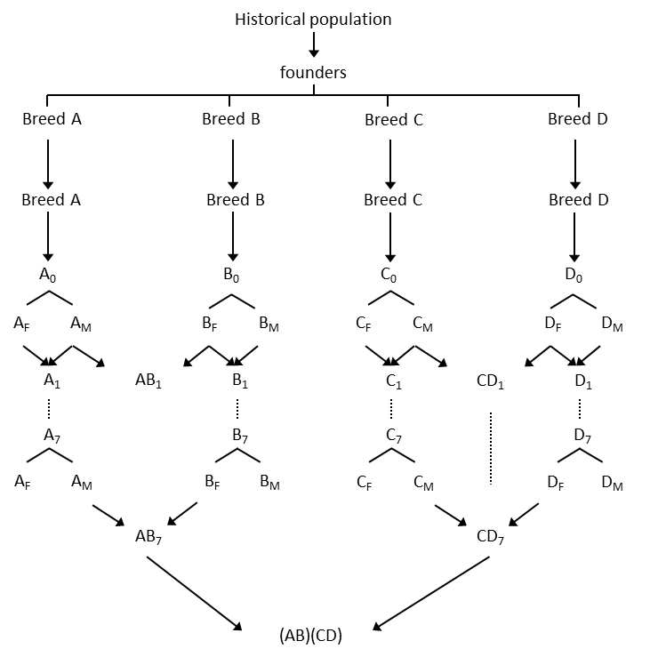

\let\oldShaded\Shaded
\let\endoldShaded\endShaded
\renewenvironment{Shaded}{\small\oldShaded}{\endoldShaded}

\let\oldverbatim\verbatim
\let\endoldverbatim\endverbatim
\renewenvironment{verbatim}{\small\oldverbatim}{\endoldverbatim}

\newpage

## Introduction
Simulation has and will continue to play an important role in the study of genomic selection. ```xbreed``` is a simulation tool for purebred and crossbred genomic data as well as pedigree and phenotypes. It can be used for simulation of a population with flexible genome structures and trait genetic architectures. ```xbreed``` can also be used to evaluate breeding schemes and generate genetic data to test statistical tools. Furthermore, the package is handy, intuitive and has good performance properties in execution time and memory usage, even when handling large amounts of genetic data. This vignette intends to explain in detail how ```xbreed``` package works for the desired applications, and it includes illustrated explanations and easily reproducible examples. In conclusion, ```xbreed``` would be a useful tool for the methodological and theoretical studies in the population and quantitative genetics and breeding. 

## Workflow
Simulation in ```xbreed``` is basically carried out in two steps. In the first step, historical generations are simulated to create desirable level of LD and in the second step, recent population structures are generated, which can be as simple as a purebred line or a four-way crossbreed population. ```xbreed``` allows for a wide range of parameters to be incorporated in the simulation models in order to produce appropriate simulation data.  

```make_hp``` is the central function in the package (Figure 1). This function is used to create historical population and genomic structure of the trait of interest. A wide range of parameters can be specified for simulating the genome, such as: number of chromosomes, markers and QTL, location of markers and QTL, mutation rate and initial allelic frequencies. This flexibility permits for a wide variety of genetic architectures to be considered. As an example, user can simulate SNP chip genotypes data mimicking the real genotypic data of different livestock species.    

Other functions in the package are dependent to the function ```make_hp```. Function ```sample_hp``` is used to sample individuals from the last generation of historical population. This function can be used multiple times to sample individuals from the last generation of historical population to create recent populations.   

Function ```make_hp``` works on the output of the function ```sample_hp``` and also itself (Figure 1). This means that, once a recent population (e.g. RP1) is created by ```sample_hp```, function ```make_rp``` can be used, to create the second recent population (RP2) based on the data of RP1. Features of the functions ```sample_hp``` and ```make_rp``` are the same as both can create recent populations. However, the difference between these two functions is that, for function ```sample_hp```, male and female founders are always from the last generation of historical population, whereas, in function ```make_rp```, male and female founders can be selected from any generation of the population created by ```sample_hp``` or itself. In othe words, function ```make_hp``` can get the output of itself as input. See examples for more clarification.  

Function ```xbreed``` is used for crossing between populations. These populations can be the ones created by functions ```make_rp``` and ```sample_hp``` (Figure 1). Also, if user would like to have multi-way crossbreeding schemes such as three-way or four-way crossbreeding, then function ```xbreed``` can be used to get the output of itself as input data in order to create the multi-way crossbreed populations. Simulations of two-way and multi-way crossbreeding schemes are presented in the example section.


## Validation of simulated genomes
### Heterozygosity and Linkage disequilibrium
A number of arbitrary assumptions are made during the simulation of genomes, which makes it necessary to confirm that characteristics of the simulated data are similar to expectations. Equations for LD [$r^2$ (Hill and Robertson 1968)] and heterozygosity given some population parameters have been described in the literature. Deterministic predictions for these parameters may not exist for complex population histories, which may involve expansion or reductions in $N_e$. However, in such cases simulation programs can still be evaluated using a simple population history before moving on to more complex models. The expected heterozygosity of loci, $H_e$, for a given effective population size, $N_e$, and mutation rate, $u$, is $$E(H_e)\approx 4N_eu/[4N_eu+1]$$ (Kimura and Crow 1964). Under infinite-allele model, mutation creates new unique allele that never existed in the population. For finite-allele model, mutation does not create novel allele but rather modifies an allele to another allele within the allelic space with the same probability. Recurrent mutation can be reversible. At equilibrium $H_e$ is approximately, 
$$E(H_e)\approx 1-\left[ \frac{1+(4N_eu/k-1)}{1+(4N_euk/k-1)} \right]$$
where k is the number of possible alleles.

Similarly, expected values for LD have been described for scenarios without mutation, $E(r^2) \approx 1/[1+4N_ec]$ (Sved 1971), and with mutation, $E(r^2)\approx 1/[2+ 4N_ec]$  (Tenesa et al. 2007), where $c$ is the recombination rate. Hudson (1985) has shown that expectations are met only when loci with allele frequency, 0.05 are removed from LD calculations. 

###  Allele frequency distribution
Considering a finite population and the recurrent mutation of two alleles, Wright (1937) shows that the probability of the allele frequency ($p$) at mutation-drift equilibrium can be obtained by the asymptotic formula: 
$$prob(p) \sim p^{4N_eu-1}(1-p)^{4N_ev-1}$$

where $u$ and $v$ are the mutation rates of two alleles. This formula indicates the allele frequency distribution at mutation-drift equilibrium depends only on $N_e$, $u$ and $v$. Under the assumption that $u$  = $v$ , when $4N_eu$ is less than 1, close to 0, and greater than 1, the allele frequencies are expected to exhibit a U-shaped, uniform and convex distribution, respectively. 

## Evaluation of simulated genomes
In the following we assessed the characteristics of the genome simulated by ```xbreed```. An historical population was simulated for 2000 generations of random mattings with an effective population size ($N_e$) of 100 (50 males and 50 females). The simulated genome consisted of one chromosome with a length ($L$) of 1 Morgan, containing 2000 randomly spaced SNP loci. The initial minor allele frequency ($laf$) of all SNPs was assumed to be 0, meaning all individuals were completely homozygous for the same allele in the first generation of the historical population. Mutation occurred at a rate ($mutr$) of $2.5*10^{-4}$ per locus meiosis and involved the switching from one allele to another. Recombinations were sampled from a Poisson distribution with a mean of 1 per Morgan and were then randomly placed along the chromosome. The code used for assessing quality of simulated genome is in Example the mean heterozygosity and $r^2$ of all replicates was compared to expected values (Table 1).   
Table 1. Actual and expected Heterzygosity, $H_e$, and LD between adjacent loci, $r^2$, in simulated data.

```{r kable, echo = FALSE}
a<-data.frame()
a<-data.frame(matrix(NA, nrow=2, ncol=2))
colnames(a)<-c("Expected","Observed")
rownames(a)<-c("He","LD(r2)")
a[1,]<-c(0.09,0.11)	
a[2,]<-c(0.37,0.25)	
library(knitr)
kable(a)
```

Decay of average $r^2$ over distance in the last generation of historical population is in Figure 2. To determine the decay of LD with increasing distance between SNPs, the average $r^2$ was expressed as a function of distance between SNPs. SNP pairs were grouped by their pairwise distance into intervals of 1 cM, starting from 0 up to 100 cM. The average $r^2$ for SNP pairs in each interval was estimated as the mean of all $r^2$ within that interval.




The allele frequency distributions in the last generation of the historical population are in Figure 3. Based on the simulation parameters defined above, the value for $4N_eu$ was 0.1 that is smaller than one. At mutation-drift equilibrium, for values of $4N_eu$ smaller than 1, a U-shaped distribution is expected. Also, we considered a case that $4N_eu$ was greater than 1. To do so, we increased mutation rate ($mutr$) to $5*10^{-3}$. When $4N_eu$ is larger than 1, normal distribution of allele frequencies is expected, respectively (Wright, 1937). 




##Implementation and efficiency
The program is written in R, however time-consuming parts of each function in the package are in Fortran. So, compared to routine packages in R, ```xbreed``` is efficient in terms of computing time. The computing time and RAM demanding on a mediocre PC, with 2.3 GHz CPU, 4 GB RAM is 1.51 minutes and 5 Mb, respectively, for simulating 10K SNP panel, 1000 historical generations with $N_e$ = 100. The most important parameters affecting CPU time and memory are population size and the number of loci (markers and QTL). However, depending on the simulation scenario, other parameters such as 'gebv(c)' as selection criteria which demands training on each generation of simulation, and  saving huge outputs, etc. might become a computational bottleneck. Nonetheless, ```xbreed``` provides the user with enough options to manage the outputs or turn off unwanted computations. For example, one may optionally save genotypes only for last few generations avoiding large outputs.


## Examples
Examples below demonstrate some main features of the package. The mechanism to create markers, population structure, and trait phenotypes are detailedly proposed. The idea was to show some basic breeding schemes, however more complex simulation structures are possible according to the user desire.   
  

### Example 1: Make historical population
Assessing quality of simulated genome for a population of $N_e$=100 for 1000 historical generations.

```{r , include=TRUE,eval=FALSE}
library(xbreed)

#Genome parameters
genome<-data.frame(matrix(NA, nrow=1, ncol=6))
names(genome)<-c("chr","len","nmrk","mpos","nqtl","qpos")
genome$chr[1]<-c(1)         #Chromosome id
genome$len[1]<-c(100)	    #Chromosome length in cM
genome$nmrk[1]<-c(2000)     #Number of markers
genome$mpos[1]<-c('rnd')	#Position of markers
genome$nqtl[1]<-c(2)        #Number of qtl
genome$qpos[1]<-c('rnd')	#Position of qtl
genome

hp<-make_hp(hpsize=100
,ng=1000,h2=0.3,d2=0,phen_var=1
,genome=genome,mutr=2.5*10**-4,laf=1)

# Expected Heterozygosity according to (Kimura and Crow 1964)
mutr<-2.5*10**-4
ne<-100
k<-2
Fneu<-4*ne*mutr
Expected_het1<-1-((1+((Fneu)/(k-1)))/(1+((Fneu*k)/(k-1))))
Expected_het2<-Fneu/(1+Fneu)

Expected_het1
Expected_het2

# Observed Heterozygosity 
het_observed<-mean(2*(hp$freqMrk[,3]*hp$freqMrk[,4]))
het_observed

# Mean r2 and LD decay 
mat<-hp$hp_mrk[,-1]
LD<-calc_LD(mat=mat,MAF=0.1,method='adjacent',LD_summary=TRUE)
LD$Mean_r2

linkage_map<-hp$linkage_map_mrk[,3]
LD<-calc_LD(mat=mat,MAF=0.10,
method='pairwise',LD_summary=TRUE,
linkage_map=linkage_map,interval=0.5)

LD$ld_decay

```


### Example 2: Simulation of an additive trait
Simulation of a recent population following historical population. Simulation of an additive trait with $h^2$=0.3. A genome consisting of three chromosomes with different parameters. 

```{r ,include=TRUE,eval=FALSE}

# Genome consisted of 3 chromosomes
genome<-data.frame(matrix(NA, nrow=3, ncol=6))
names(genome)<-c("chr","len","nmrk","mpos","nqtl","qpos")
genome$chr<-c(1:3)
genome$len<-c(146,126,116)	
genome$nmrk<-c(1000,2000,500)
genome$mpos<-c('even','rnd','rnd')	
genome$nqtl<-c(80,100,90)
genome$qpos<-c('rnd','even','rnd')	
genome

# CREATE HISTORICAL POPULATION
hp<-make_hp(hpsize=200
,ng=500,h2=0.3,phen_var=1
,genome=genome,mutr=5*10**-3,sel_seq_qtl=0.1,sel_seq_mrk=0.05,laf=0.5)

# # MAKE RECENT POPULATION
# Select 50 males randomly as founders of recent population 
Male_founders<-data.frame(number=50,select='rnd') 
# Select 100 females as founders of recent population based on phenotype
Female_founders<-data.frame(number=100,select='phen',value='h')   
 
 
# Selection of animals in each generation of recent population 
	# Selection of 60 sires and 200 dam			
	# Selection criteria is "tbv" for sires and "gebv" for dams
	Selection<-data.frame(matrix(NA, nrow=2, ncol=3))
	names(Selection)<-c('Number','type','Value')
	Selection$Number[1:2]<-c(60,200)	
	Selection$type[1:2]<-c('tbv','gebv')	
	Selection$Value[1:2]<-c('h','h') 
	Selection

# Training parameters for the estimation of marker effects.
Training<-data.frame(matrix(NA, nrow=1, ncol=8))
names(Training)<-c('size','sel','method','nIter','burnIn','thin','save','show')
	Training$size<-200	
	Training$sel<-'min_rel_mrk' 
	Training$method<-'BRR' 
	Training$nIter<-1000 
	Training$burnIn<-100 
	Training$thin<-5    
	Training$save<-'bayes' 
	Training$show<-TRUE 
	Training

# Save output of simulation for "data", "qtl" and "freq_mrk" 
	sh_output<-data.frame(matrix(NA, nrow=3, ncol=3))
	names(sh_output)<-c("data","qtl","freq_mrk")
	sh_output[,1]<-c(0,3,4) # Save data for generations 0,3,4
	sh_output[,2]<-c(1,2,4) # Save qtl genotype for generations 1,2,4
	sh_output[,3]<-c(3,4,5) # Save marker frequencies for generations 3,4,5
	sh_output
	
# CREATE RECENT POPULATION
my_hp<-sample_hp(hp_out=hp,Male_founders=
Male_founders,Female_founders=Female_founders,
ng=4,Selection=Selection,Training=Training,
litter_size=5,saveAt="my_pop",sh_output=sh_output,Display=TRUE)

# SOME OUTPUT
my_hp$summary_data
my_hp$output[[1]]$data # Data for base generation (0)
my_hp$output[[2]]$freqMRK # Marker frequncy for generation 1
head(my_hp$output[[4]]$qtl) # QTL genotye of individuals for generation 3
my_hp$trait # Tait specifications

```

### Example 3: Simulation of a trait with additive and dominance effects
Simulation of a trait with both additive and dominance effects with $h^2$=0.3 and dominance variance of 0.1. Two recent populations are created. In the first recent population (RP1) founders are from the last generation of historical population. In the second recent population (RP2), male and female founders are from different generations of RP1. Simulated genome is 10k SNP panel with 20 qtl on each chromosome.     

```{r ,include=TRUE,eval=FALSE}
# CREATE HISTORICAL POPULATION

# 10k SNP panel
genome<-data.frame(matrix(NA, nrow=30, ncol=6))
names(genome)<-c("chr","len","nmrk","mpos","nqtl","qpos")
genome$chr<-c(1:30)
genome$len<-rep(100,30)	
genome$nmrk<-rep(333,30)	
genome$mpos<-rep('rnd',30)	
genome$nqtl<-rep(20,30)	
genome$qpos<-rep('even',30)
genome

hp<-make_hp(hpsize=200
,ng=500,h2=0.3,d2=0.1,phen_var=1
,genome=genome,mutr=5*10**-4,sel_seq_qtl=0.05,sel_seq_mrk=0.05,laf=0.5)


# # MAKE RECENT POPULATION ONE (RP1)
# Select 50 males 100 females randomly as founders of recent population 
Male_founders<-data.frame(number=50,select='rnd') 
Female_founders<-data.frame(number=100,select='rnd')   

# Selection of animals in each generation of recent population 
	# Selection of 70 sires and 110 dam			
	# Selection criteria is "rnd" for both sires and dams
Selection<-data.frame(matrix(NA, nrow=2, ncol=2))
names(Selection)<-c('Number','type')
Selection$Number[1:2]<-c(70,110)	
Selection$type[1:2]<-c('rnd','rnd')	
Selection

# Save "data" and "marker" for first and last generation of RP1
sh_output<-data.frame(matrix(NA, nrow=2, ncol=2))
names(sh_output)<-c("data","marker")
sh_output[,1]<-c(1,5) # Save data for generations 1 and 5
sh_output[,2]<-c(1,5) # Save marker genotype for generations 1 and 5
sh_output

 RP_1<-sample_hp(hp_out=hp,Male_founders=
 Male_founders,Female_founders=Female_founders,
 ng=5,Selection=Selection,litter_size=5,saveAt="RP1",
 sh_output=sh_output,Display=TRUE)

# # MAKE RECENT POPULATION TWO(RP2)
   # Select founders for RP2
   # Select 45 males based on 'tbv' from generation 4 of RP1. 
Males<-data.frame(number=45,generation=4,select='tbv',value='h')
   # Select 80 females based on 'phen' from generation 5 of RP1. 
Females<-data.frame(number=80,generation=3,select='phen',value='l')

# Selection of animals in each generation of RP2
	# Selection of 40 sires and 80 dam			
	# Selection criteria is "tbv" for sires and "gebv" for dams
 Selection<-data.frame(matrix(NA, nrow=2, ncol=3))
 names(Selection)<-c('Number','type','Value')
 Selection$Number[1:2]<-c(40,80)	
 Selection$type[1:2]<-c('tbv','gebv')	
 Selection$Value[1:2]<-c('h','h') 
 Selection
 
# Training parameters 
	Training<-data.frame(matrix(NA, nrow=1, ncol=3))
	names(Training)<-c('size','sel','method')
	Training$size<-300	
	Training$sel<-'rnd' 
	Training$method<-'BL' 
	Training

# Save all data for the last two generations of RP2
	rp2_output<-data.frame(matrix(NA, nrow=2, ncol=6))
	names(rp2_output)<-c('data','qtl','marker','seq','freq_qtl','freq_mrk')
	rp2_output[,1]<-c(3,4)
	rp2_output[,2]<-c(3,4)
	rp2_output[,3]<-c(3,4)
	rp2_output[,4]<-c(3,4)
	rp2_output[,5]<-c(3,4)
	rp2_output[,6]<-c(3,4)
	rp2_output

RP_2<-make_rp(sh_out=RP_1,Male_founders=Males,
Female_founders=Females,Selection=Selection,
ng=4,litter_size=4,saveAt='RP2',Training=Training,
rp_output=rp2_output)

# Some Output
RP_2$summary_data
RP_2$output[[4]]$data # Data for base generation 3
RP_2$output[[3]]$freqQTL # QTL frequncy for generation 2
head(RP_2$output[[4]]$mrk) # Marker genotye of individuals for generation 3
 
```


### Example 4: Multiple recent populations and LD
Create multiple recent populations by function ```make_rp``` and measurement of LD for each chromosome in the last recent population.

```{r ,include=TRUE,eval=FALSE}
# CREATE HISTORICAL POPULATION

# Genome consisted of 3 chromosomes
genome<-data.frame(matrix(NA, nrow=3, ncol=6))
names(genome)<-c("chr","len","nmrk","mpos","nqtl","qpos")
genome$chr<-c(1:3)
genome$len<-c(110,123,109)	
genome$nmrk<-c(980,1000,1500)
genome$mpos<-c('rnd','rnd','rnd')	
genome$nqtl<-c(80,100,90)
genome$qpos<-c('rnd','rnd','rnd')	
genome

hp<-make_hp(hpsize=100
,ng=300,h2=0.3,d2=0.1,phen_var=1
,genome=genome,mutr=5*10**-4,sel_seq_qtl=0.05,sel_seq_mrk=0.05,laf=0.5)

# # MAKE RECENT POPULATION ONE (RP_1) BY FUNCTION sample_hp
	# Selection of founders for RP_1
	Male_founders<-data.frame(number=50,select='rnd') 
	Female_founders<-data.frame(number=50,select='rnd')   

	# Selection scheme in RP_1 
	Selection<-data.frame(matrix(NA, nrow=2, ncol=2))
	names(Selection)<-c('Number','type')
	Selection$Number[1:2]<-c(30,60)	
	Selection$type[1:2]<-c('rnd','rnd')	
	Selection

	RP_1<-sample_hp(hp_out=hp,Male_founders=
	Male_founders,Female_founders=Female_founders,
	ng=5,Selection=Selection,litter_size=4)

# # MAKE RECENT POPULATION TWO (RP_2) BY FUNCTION make_rp
	# Selection of founders from RP_1
	Males<-data.frame(number=45,generation=5,select='tbv',value='h')
	Females<-data.frame(number=80,generation=5,select='phen',value='l')

	# Selection scheme in RP_2 
	Selection<-data.frame(matrix(NA, nrow=2, ncol=3))
	names(Selection)<-c('Number','type','Value')
	Selection$Number[1:2]<-c(40,80)	
	Selection$type[1:2]<-c('phen','phen')	
	Selection$Value[1:2]<-c('h','h') 
	Selection

	RP_2<-make_rp(sh_out=RP_1,Male_founders=Males,
	Female_founders=Females,Selection=Selection,
	ng=7,litter_size=4)

# # MAKE RECENT POPULATION THREE (RP_3) BY FUNCTION make_rp	
	# Selection of founders from RP_2
	Males<-data.frame(number=40,generation=3,select='phen',value='h')
	Females<-data.frame(number=70,generation=7,select='phen',value='h')

	# Selection scheme in RP_3 
	Selection<-data.frame(matrix(NA, nrow=2, ncol=3))
	names(Selection)<-c('Number','type','Value')
	Selection$Number[1:2]<-c(40,80)	
	Selection$type[1:2]<-c('tbv','phen')	
	Selection$Value[1:2]<-c('h','h') 
	Selection

	RP_3<-make_rp(sh_out=RP_2,Male_founders=Males,
	Female_founders=Females,Selection=Selection,
	ng=4,litter_size=5)
		
# # Measurment of LD for the last generation 
#  of RP_3 for each chromosomes 

	# Extracting No of markers in each chromosome
	linkage_map<-RP_3$linkage_map_mrk
	No_mrk_in_each_chr<-c()
	for (i in 1:3){
	a<-subset(linkage_map,linkage_map[,2]==i)
	No_mrk_in_each_chr[i]<-length(a[,3])
	}
	No_mrk_in_each_chr

# Measurments of LD in Chromosome 1
	chr<-1          
	generation<-4    # Generation 4
	linkage_map<-RP_3$linkage_map_mrk
	linkage_map<-subset(linkage_map,linkage_map[,2]==chr)
	linkage_map<-linkage_map[,3]
	x<-No_mrk_in_each_chr[chr]

	mat<-RP_3$output[[generation+1]]$mrk
	mat<-mat[,-c(1,2)]
	mat<-mat[,1:(x*2)]
	
    # Mean r2
	rLD<-calc_LD(mat=mat,MAF=0.1,method='adjacent')
	
	# LD decay
	rLD<-calc_LD(mat=mat,MAF=0.1,method='pairwise',
	LD_summary=TRUE,linkage_map=linkage_map,interval=1)
	rLD$ld_decay
	
# Measurments of LD in Chromosome 2
	chr<-2         
	generation<-4    # Generation 4
	linkage_map<-RP_3$linkage_map_mrk
	linkage_map<-subset(linkage_map,linkage_map[,2]==chr)
	linkage_map<-linkage_map[,3]
	C1<-No_mrk_in_each_chr[1]*2
	C2<-(No_mrk_in_each_chr[1]+No_mrk_in_each_chr[2])*2

	mat<-RP_3$output[[generation+1]]$mrk
	mat<-mat[,-c(1,2)]
	mat<-mat[,(C1+1):C2]
	
    # Mean r2
	rLD<-calc_LD(mat=mat,MAF=0.1,method='adjacent')
	
	# LD decay
	rLD<-calc_LD(mat=mat,MAF=0.1,method='pairwise',
	LD_summary=TRUE,linkage_map=linkage_map,interval=1)
	rLD$ld_decay

# Measurments of LD in Chromosome 3
	chr<-3          
	generation<-4    # Generation 4
	linkage_map<-RP_3$linkage_map_mrk
	linkage_map<-subset(linkage_map,linkage_map[,2]==chr)
	linkage_map<-linkage_map[,3]
	C1<-(No_mrk_in_each_chr[1]+No_mrk_in_each_chr[2])*2
	C2<-sum(No_mrk_in_each_chr)*2

	mat<-RP_3$output[[generation+1]]$mrk
	mat<-mat[,-c(1,2)]
	mat<-mat[,(C1+1):C2]
	
    # Mean r2
	rLD<-calc_LD(mat=mat,MAF=0.1,method='adjacent')
	
	# LD decay
	rLD<-calc_LD(mat=mat,MAF=0.1,method='pairwise',
	LD_summary=TRUE,linkage_map=linkage_map,interval=1)
	rLD$ld_decay	
```

### Example 5: Two-way crossbreeding  
Simulation of a two-way crossbreeding program. The crossbreeding scheme in this example involves three steps:    
Step 1: Historical population is created.      
Step 2: Two recent populations named as Breed A and B are created by sampling individuals from historical population.       
Step 3: Breed A and B are crossed.  
 
Schematic representation of the two-way crossbreeding in this example is in Figure 4.

```{r ,include=TRUE,eval=FALSE}

# # STEP 1: CREATE HISTORICAL POPULATION

	# Genome consisted of 4 chromosomes
	genome<-data.frame(matrix(NA, nrow=4, ncol=6))
	names(genome)<-c("chr","len","nmrk","mpos","nqtl","qpos")
	genome$chr<-c(1:4)
	genome$len<-c(94,110,111.5,78.3)	
	genome$nmrk<-c(500,500,500,500)
	genome$mpos<-rep('rnd',4)	
	genome$nqtl<-c(70,80,90,65)
	genome$qpos<-rep('rnd',4)	
	genome

	historical<-make_hp(hpsize=200
	,ng=300,h2=0.25,d2=0.10,phen_var=1
	,genome=genome,mutr=5*10**-4,sel_seq_qtl=0.1,sel_seq_mrk=0.05,laf=0.5)

# # STEP 2: MAKE BREED A AND B 
	# BREED A
	Breed_A_Male_fndrs<-data.frame(number=50,select='rnd') 
	Breed_A_Female_fndrs<-data.frame(number=50,select='rnd') 
	   
	# Selection and matings in Breed A
		# Selection of 50 sires and 100 dam			
		# Selection criteria is "rnd" for both sires and dams
	 Selection<-data.frame(matrix(NA, nrow=2, ncol=2))
	 names(Selection)<-c('Number','type')
	 Selection$Number[1:2]<-c(50,100)	
	 Selection$type[1:2]<-c('rnd','rnd')	
	 Selection

	# Save information for the last generation of Breed A
	Breed_A_data<-data.frame(matrix(NA, nrow=1, ncol=6))
	names(Breed_A_data)<-c('data','qtl','marker','seq','freq_qtl','freq_mrk')
	Breed_A_data[,1]<-10 
	Breed_A_data[,2]<-10 
	Breed_A_data[,3]<-10
	Breed_A_data[,4]<-10
	Breed_A_data[,5]<-10
	Breed_A_data[,6]<-10
	Breed_A_data

	Breed_A<-sample_hp(hp_out=historical,Male_founders=
	Breed_A_Male_fndrs,Female_founders=Breed_A_Female_fndrs,
	ng=10,Selection=Selection,
	litter_size=5,saveAt="BreedA",sh_output=Breed_A_data,Display=TRUE)
	 
	# BREED B
	Breed_B_Male_fndrs<-data.frame(number=50,select='rnd') 
	Breed_B_Female_fndrs<-data.frame(number=50,select='rnd') 
	   
	# Selection and matings in Breed B
		# Selection of 50 sires and 100 dam			
		# Selection criteria is "phen" for both sires and dams
	Selection<-data.frame(matrix(NA, nrow=2, ncol=3))
	names(Selection)<-c('Number','type','Value')
	Selection$Number[1:2]<-c(50,100)	
	Selection$type[1:2]<-c('phen','phen')	
	Selection$Value[1:2]<-c('h','h') 
	Selection

	Breed_B<-sample_hp(hp_out=historical,Male_founders=
	Breed_B_Male_fndrs,Female_founders=Breed_B_Female_fndrs,
	ng=10,Selection=Selection,
	litter_size=5)
	

# # STEP 3: CROSSING BETWEEN BREED A AND B

    # Selection of founders in crossbreeding for Breed A 
  		# Selection of 100 sires/dams from last generation of Breed_A in step 2. 			
		# Selection criteria is "rnd" for both sires and dams
	founder_pop1<-data.frame(matrix(NA, nrow=2, ncol=3))
	names(founder_pop1)<-c('size','generation','select')
	founder_pop1[1,]<-c(100,10,'rnd') 
	founder_pop1[2,]<-c(100,10,'rnd')
	founder_pop1
	  
	# Selection of founders in crossbreeding for Breed B 
		# Selection of 80 sires and 150 dams			
		# Selection criteria is "phen" for sires 
		# Selection criteria is "rnd" for dams
	founder_pop2<-data.frame(matrix(NA, nrow=2, ncol=4))
	names(founder_pop2)<-c('size','generation','select','value')
	founder_pop2[1,]<-c(80,10,'phen','h') 
	founder_pop2[2,]<-c(150,10,'rnd','h') # "h" will be ignored as SC is "rnd"
	founder_pop2

	# Selection of animals from founder_pop1 and founder_pop2 to be crossed
	founder_cross<-data.frame(matrix(NA, nrow=2, ncol=4))
	names(founder_cross)<-c('pop','size','select','value')
	founder_cross[1,]<-c('pop1',50,'tbv','h') # Select males from Breed A
	founder_cross[2,]<-c('pop2',100,'phen','h')  # Select females from Breed B
	founder_cross

	# Selection scheme in Breed A to produce purebred replacement animals 
	Selection_pop1<-data.frame(matrix(NA, nrow=2, ncol=3))
	names(Selection_pop1)<-c('Number','type','Value')
	Selection_pop1$Number[1:2]<-c(100,100)				
	Selection_pop1$type[1:2]<-c('gebv','gebv')	
	Selection_pop1$Value[1:2]<-c('h','h')
	Selection_pop1
	
	# Selection scheme in Breed B to produce purebred replacement animals 
	Selection_pop2<-data.frame(matrix(NA, nrow=2, ncol=3))
	names(Selection_pop2)<-c('Number','type','Value')
	Selection_pop2$Number[1:2]<-c(100,100)				
	Selection_pop2$type[1:2]<-c('gebv','gebv')	
	Selection_pop2$Value[1:2]<-c('h','h')
	Selection_pop2
	
	# Selection scheme for crossing between A and B
	Cross_design<-data.frame(matrix(NA, nrow=2, ncol=4))
	names(Cross_design)<-c('pop','size','select','value')
	Cross_design[1,]<-c('pop1',100,'gebvc','h') 
	Cross_design[2,]<-c('pop2',200,'gebvc','h')
	Cross_design

	# Training in Breed A 
	train_A<-data.frame(matrix(NA, nrow=1, ncol=5))
	names(train_A)<-c('size','sel','method','nIter','show')
	train_A$size<-500	
	train_A$sel<-'rnd'
	train_A$method<-'BRR' 
	train_A$nIter<-1000 
	train_A$show<-TRUE 
	train_A

	# Training in Breed B 
	train_B<-data.frame(matrix(NA, nrow=1, ncol=5))
	names(train_B)<-c('size','sel','method','nIter','show')
	train_B$size<-500	
	train_B$sel<-'rnd'
	train_B$method<-'BRR' 
	train_B$nIter<-1000 
	train_B$show<-TRUE 
	train_B
		 
	# Save information for crossbred AB for the last 2 generations
	output_cross<-data.frame(matrix(NA, nrow=4, ncol=5))
	names(output_cross)<-c('data','qtl','marker','freq_qtl','freq_mrk')
	output_cross[,1]<-c(6,7)
	output_cross[,2]<-c(6,7)
	output_cross[,3]<-c(6,7)
	output_cross[,4]<-c(6,7)
	output_cross[,5]<-c(6,7)
	output_cross

cross_AB<-xbreed(pop1=Breed_A,pop2=Breed_B,founder_pop1=
founder_pop1,founder_pop2=founder_pop2,
founder_cross=founder_cross,
Selection_pop1=Selection_pop1,Selection_pop2=Selection_pop2,
Cross_design=Cross_design,train_type='purebred',
train_pop1=train_A,train_pop2=train_B,ng=7,litter_size=5,
saveAt='cross_pop',output_cross=output_cross,Display=TRUE)

# SOME OUTPUT
	cross_AB$summary_data_pop1  # Summary Breed A
	cross_AB$summary_data_pop1  # Summary Breed B
	cross_AB$summary_data_cross # Summary of AB crossbred

	# Data for the last generation of BREED A
	cross_AB$pop1[[8]]$data

	# Data for the last generation of BREED B
	cross_AB$pop2[[8]]$data

	# Data for the last generation of crossbreds
	cross_AB$cross$output[[8]]$data

```




### Example 6: Three-way crossbreeding  
Simulation of a three-way crossbreeding program. The crossbreeding scheme in this example involves four steps:    
Step 1: Historical population is created.      
Step 2: Three recent populations named as Breed A, B and C are created by sampling individuals from last generation of historical population.
Step 3: Breed A and B are crossed.  
Step 4: Breed C as sire line is crossed to the female crossbred progeny of Breed A and B named as (AB).  

```{r ,include=TRUE,eval=FALSE}

# # STEP 1: CREATE HISTORICAL POPULATION

	# Genome consisted of 2 chromosomes
	genome<-data.frame(matrix(NA, nrow=2, ncol=6))
	names(genome)<-c("chr","len","nmrk","mpos","nqtl","qpos")
	genome$chr<-c(1:2)
	genome$len<-c(94,110)	
	genome$nmrk<-c(1100,1050)
	genome$mpos<-c('even','rnd')	
	genome$nqtl<-c(90,100)
	genome$qpos<-c('even','rnd')	
	genome

	historical<-make_hp(hpsize=300
	,ng=400,h2=0.5,d2=0.10,phen_var=1
	,genome=genome,mutr=5*10**-4,sel_seq_qtl=0.1,sel_seq_mrk=0.05,laf=0.5)

# # STEP 2: MAKE BREED A, B AND C
	# BREED A
	Breed_A_Male_fndrs<-data.frame(number=50,select='rnd') 
	Breed_A_Female_fndrs<-data.frame(number=50,select='rnd') 
	   
	# Selection scheme in Breed A
	 Selection<-data.frame(matrix(NA, nrow=2, ncol=2))
	 names(Selection)<-c('Number','type')
	 Selection$Number[1:2]<-c(50,100)	
	 Selection$type[1:2]<-c('rnd','rnd')	
	 Selection
 
	Breed_A<-sample_hp(hp_out=historical,Male_founders=
	Breed_A_Male_fndrs,Female_founders=Breed_A_Female_fndrs,
	ng=10,Selection=Selection,
	litter_size=4,Display=TRUE)
	 
	# BREED B
	Breed_B_Male_fndrs<-data.frame(number=50,select='rnd') 
	Breed_B_Female_fndrs<-data.frame(number=50,select='rnd') 
	   
	# Selection scheme in Breed B
	Selection<-data.frame(matrix(NA, nrow=2, ncol=3))
	names(Selection)<-c('Number','type','Value')
	Selection$Number[1:2]<-c(50,50)	
	Selection$type[1:2]<-c('phen','phen')	
	Selection$Value[1:2]<-c('h','h') 
	Selection
 
	Breed_B<-sample_hp(hp_out=historical,Male_founders=
	Breed_B_Male_fndrs,Female_founders=Breed_B_Female_fndrs,
	ng=10,Selection=Selection,
	litter_size=5)
	
	# BREED C
	Breed_C_Male_fndrs<-data.frame(number=50,select='rnd') 
	Breed_C_Female_fndrs<-data.frame(number=50,select='rnd') 
	   
	# Selection scheme in Breed C
	Selection<-data.frame(matrix(NA, nrow=2, ncol=3))
	names(Selection)<-c('Number','type','Value')
	Selection$Number[1:2]<-c(50,50)	
	Selection$type[1:2]<-c('tbv','tbv')	
	Selection$Value[1:2]<-c('h','h') 
	Selection

	Breed_C<-sample_hp(hp_out=historical,Male_founders=
	Breed_C_Male_fndrs,Female_founders=Breed_C_Female_fndrs,
	ng=5,Selection=Selection,
	litter_size=5)
	
# # STEP 3: CROSSING BETWEEN BREED A AND B

    # Selection of founders in crossbreeding for Breed A 
  		# Selection of 100 sires and 100 dams			
		# Selection criteria is "phen" for both sires and dams
	founder_pop1<-data.frame(matrix(NA, nrow=2, ncol=4))
	names(founder_pop1)<-c('size','generation','select','value')
	founder_pop1[1,]<-c(100,10,'phen','h') 
	founder_pop1[2,]<-c(100,10,'phen','h')
	founder_pop1
	  
	# Selection of founders in crossbreeding for Breed B 
		# Selection of 80 sires and 100 dams			
		# Selection criteria is "rnd" for both sires and dams
	founder_pop2<-data.frame(matrix(NA, nrow=2, ncol=3))
	names(founder_pop2)<-c('size','generation','select')
	founder_pop2[1,]<-c(80,10,'rnd') 
	founder_pop2[2,]<-c(100,10,'rnd')
	founder_pop2

	# Selection of animals from founder_pop1 and founder_pop2 to be crossed
	founder_cross<-data.frame(matrix(NA, nrow=2, ncol=4))
	names(founder_cross)<-c('pop','size','select','value')
	founder_cross[1,]<-c('pop1',50,'rnd','h') # Select males from Breed A
	founder_cross[2,]<-c('pop2',100,'phen','h')  # Select females from Breed B
	founder_cross

	# Selection scheme in Breed A to produce purebred replacement animals 
	Selection_pop1<-data.frame(matrix(NA, nrow=2, ncol=3))
	names(Selection_pop1)<-c('Number','type','Value')
	Selection_pop1$Number[1:2]<-c(100,100)				
	Selection_pop1$type[1:2]<-c('gebv','gebv')	
	Selection_pop1$Value[1:2]<-c('h','h')
	Selection_pop1
	
	# Selection scheme in Breed B to produce purebred replacement animals 
	Selection_pop2<-data.frame(matrix(NA, nrow=2, ncol=3))
	names(Selection_pop2)<-c('Number','type','Value')
	Selection_pop2$Number[1:2]<-c(100,100)				
	Selection_pop2$type[1:2]<-c('gebv','gebv')	
	Selection_pop2$Value[1:2]<-c('h','h')
	Selection_pop2
	
	# Selection scheme for crossing between A and B
	Cross_design<-data.frame(matrix(NA, nrow=2, ncol=4))
	names(Cross_design)<-c('pop','size','select','value')
	Cross_design[1,]<-c('pop1',100,'gebvc','h') 
	Cross_design[2,]<-c('pop2',100,'gebvc','h')
	Cross_design

	# Training in Breed A 
	train_A<-data.frame(matrix(NA, nrow=1, ncol=5))
	names(train_A)<-c('size','sel','method','nIter','show')
	train_A$size<-500	
	train_A$sel<-'rnd'
	train_A$method<-'BRR' 
	train_A$nIter<-1000 
	train_A$show<-TRUE 
	train_A

	# Training in Breed B 
	train_B<-data.frame(matrix(NA, nrow=1, ncol=5))
	names(train_B)<-c('size','sel','method','nIter','show')
	train_B$size<-500	
	train_B$sel<-'rnd'
	train_B$method<-'BRR' 
	train_B$nIter<-1000 
	train_B$show<-TRUE 
	train_B
		 
	# Save information for crossbred AB
	output_cross<-data.frame(matrix(NA, nrow=4, ncol=5))
	names(output_cross)<-c('data','qtl','marker','freq_qtl','freq_mrk')
	output_cross[,1]<-c(1,2,6,7)
	output_cross[,2]<-c(1,2,6,7)
	output_cross[,3]<-c(1,2,6,7)
	output_cross[,4]<-c(1,2,6,7)
	output_cross[,5]<-c(1,2,6,7)
	output_cross

cross_AB<-xbreed(pop1=Breed_A,pop2=Breed_B,founder_pop1=
founder_pop1,founder_pop2=founder_pop2,
founder_cross=founder_cross,
Selection_pop1=Selection_pop1,Selection_pop2=Selection_pop2,
Cross_design=Cross_design,train_type='purebred',
train_pop1=train_A,train_pop2=train_B,ng=7,litter_size=5,
saveAt='cross_pop',output_cross=output_cross,Display=TRUE)

# # STEP 4: CROSSING BETWEEN AB CROSSBREDS AND BREED C

    # Selection of founders from AB crossbreds
  		# Selection of 100 sires and 100 dams			
		# Selection criteria is "rnd" for sires and "tbv" for dams
	founder_pop1<-data.frame(matrix(NA, nrow=2, ncol=4))
	names(founder_pop1)<-c('size','generation','select','value')
	founder_pop1[1,]<-c(100,7,'rnd','l') # "l" will be ignored as SC is "rnd"
	founder_pop1[2,]<-c(100,7,'tbv','h')
	founder_pop1
	  
	# Selection of founders from Breed C 
		# Selection of 80 sires and 100 dams			
		# Selection criteria is "phen" for sires
		# Selection criteria is "rnd" dams
	founder_pop2<-data.frame(matrix(NA, nrow=2, ncol=4))
	names(founder_pop2)<-c('size','generation','select','value')
	founder_pop2[1,]<-c(80,5,'phen','h') 
	founder_pop2[2,]<-c(100,5,'rnd','l')
	founder_pop2

	# # Selection of animals from founder_pop1 (crossbred AB) 
	  # and founder_pop2 (Breed C) to be crossed
	founder_cross<-data.frame(matrix(NA, nrow=2, ncol=4))
	names(founder_cross)<-c('pop','size','select','value')
	founder_cross[1,]<-c('pop1',50,'rnd','h') # Select males from Breed C
	founder_cross[2,]<-c('pop2',100,'phen','h')  # Select females from cross of AB
	founder_cross

	# Selection scheme in AB crossbreds for subsequent generations
	Selection_pop1<-data.frame(matrix(NA, nrow=2, ncol=3))
	names(Selection_pop1)<-c('Number','type','Value')
	Selection_pop1$Number[1:2]<-c(100,100)				
	Selection_pop1$type[1:2]<-c('gebv','gebv')	
	Selection_pop1$Value[1:2]<-c('h','h')
	Selection_pop1
	
	# Selection scheme in Breed C to produce purebred replacement animals 
	Selection_pop2<-data.frame(matrix(NA, nrow=2, ncol=3))
	names(Selection_pop2)<-c('Number','type','Value')
	Selection_pop2$Number[1:2]<-c(100,100)				
	Selection_pop2$type[1:2]<-c('gebv','gebv')	
	Selection_pop2$Value[1:2]<-c('h','h')
	Selection_pop2
	
	# Selection scheme for crossing between AB and C
	Cross_design<-data.frame(matrix(NA, nrow=2, ncol=4))
	names(Cross_design)<-c('pop','size','select','value')
	Cross_design[1,]<-c('pop2',50,'gebvc','h') # Select males from Breed C
	Cross_design[2,]<-c('pop1',100,'gebvc','h') # Select females from (AB)
	Cross_design

	# Training in Crossbred AB(C)
	train<-data.frame(matrix(NA, nrow=1, ncol=5))
	names(train)<-c('size','sel','method','nIter','show')
	train$size<-500	
	train$sel<-'rnd'
	train$method<-'BL' 
	train$nIter<-1000 
	train$show<-FALSE # Iteration history won't be displayed 
	train

	# Save information for crossbred (AB)C
	output_cross<-data.frame(matrix(NA, nrow=3, ncol=4))
	names(output_cross)<-c('data','qtl','freq_qtl','freq_mrk')
	output_cross[,1]<-c(1,2,3)
	output_cross[,2]<-c(1,2,3)
	output_cross[,3]<-c(1,2,3)
	output_cross[,4]<-c(1,2,3)
	output_cross

cross_AB_C<-xbreed(pop1=cross_AB$cross,pop2=Breed_C,founder_pop1=
founder_pop1,founder_pop2=founder_pop2,
founder_cross=founder_cross,
Selection_pop1=Selection_pop1,Selection_pop2=Selection_pop2,
Cross_design=Cross_design,train_type='crossbred',
train_cross=train,ng=3,litter_size=5,
saveAt='cross_(AB)_C',output_cross=output_cross)

# SOME OUTPUT
	cross_AB_C$summary_data_pop1  # Summary Breed AB
	cross_AB_C$summary_data_pop1  # Summary Breed C
	cross_AB_C$summary_data_cross # Summary of ABC crossbred

	# Data for the last generation of crossbreds ABC
	cross_AB_C$cross$output[[4]]$data

```



### Example 7: Four-way crossbreeding   
Simulation of four-way crossbreeding program for 8 generations. The crossbreeding scheme in this example involves five steps:    
Step 1: Historical population is created.      
Step 2: Four recent populations named as Breed A, B, C and D are created by sampling individuals from the last generation of historical population.
Step 3: Breed A and B are crossed.  
Step 4: Breed C and D are crossed.  
Step 5: Crossbred males of AB are crossed to crossbred females of CD.

```{r ,include=TRUE,eval=FALSE}

# # STEP 1: CREATE HISTORICAL POPULATION

	# Genome consisted of 2 chromosomes
	genome<-data.frame(matrix(NA, nrow=2, ncol=6))
	names(genome)<-c("chr","len","nmrk","mpos","nqtl","qpos")
	genome$chr<-c(1:2)
	genome$len<-c(94,110)	
	genome$nmrk<-c(800,800)
	genome$mpos<-c('rnd','rnd')	
	genome$nqtl<-c(100,100)
	genome$qpos<-c('rnd','rnd')	
	genome

	historical<-make_hp(hpsize=400
	,ng=200,h2=0.5,d2=0.10,phen_var=1
	,genome=genome,mutr=5*10**-4,sel_seq_qtl=0.1,sel_seq_mrk=0.05,laf=0.5)

# # STEP 2: MAKE BREED A, B, C AND D
	# BREED A
	Breed_A_Male_fndrs<-data.frame(number=50,select='rnd') 
	Breed_A_Female_fndrs<-data.frame(number=50,select='rnd') 
	   
	# Selection and matings in Breed A
	 Selection<-data.frame(matrix(NA, nrow=2, ncol=2))
	 names(Selection)<-c('Number','type')
	 Selection$Number[1:2]<-c(50,50)	
	 Selection$type[1:2]<-c('rnd','rnd')	
	 Selection

	Breed_A<-sample_hp(hp_out=historical,Male_founders=
	Breed_A_Male_fndrs,Female_founders=Breed_A_Female_fndrs,
	ng=5,Selection=Selection,litter_size=5)
	 
	# BREED B
	Breed_B_Male_fndrs<-data.frame(number=50,select='rnd') 
	Breed_B_Female_fndrs<-data.frame(number=50,select='rnd') 
	   
	# Selection and matings in Breed B
	 Selection<-data.frame(matrix(NA, nrow=2, ncol=2))
	 names(Selection)<-c('Number','type')
	 Selection$Number[1:2]<-c(50,50)	
	 Selection$type[1:2]<-c('rnd','rnd')	
	 Selection

	Breed_B<-sample_hp(hp_out=historical,Male_founders=
	Breed_B_Male_fndrs,Female_founders=Breed_B_Female_fndrs,
	ng=5,Selection=Selection,litter_size=5)
	
	# BREED C
	Breed_C_Male_fndrs<-data.frame(number=50,select='rnd') 
	Breed_C_Female_fndrs<-data.frame(number=50,select='rnd') 
	   
	# Selection and matings in Breed C
	 Selection<-data.frame(matrix(NA, nrow=2, ncol=2))
	 names(Selection)<-c('Number','type')
	 Selection$Number[1:2]<-c(50,50)	
	 Selection$type[1:2]<-c('rnd','rnd')	
	 Selection

	Breed_C<-sample_hp(hp_out=historical,Male_founders=
	Breed_C_Male_fndrs,Female_founders=Breed_C_Female_fndrs,
	ng=5,Selection=Selection,litter_size=5)
	
	# BREED D
	Breed_D_Male_fndrs<-data.frame(number=50,select='rnd') 
	Breed_D_Female_fndrs<-data.frame(number=50,select='rnd') 
	   
	# Selection and matings in Breed D
	 Selection<-data.frame(matrix(NA, nrow=2, ncol=2))
	 names(Selection)<-c('Number','type')
	 Selection$Number[1:2]<-c(50,50)	
	 Selection$type[1:2]<-c('rnd','rnd')	
	 Selection

	Breed_D<-sample_hp(hp_out=historical,Male_founders=
	Breed_D_Male_fndrs,Female_founders=Breed_D_Female_fndrs,
	ng=5,Selection=Selection,litter_size=5)
	
# # STEP 3: CROSSING BETWEEN BREED A AND B

    # Selection of founders in crossbreeding for Breed A 
  		# Selection of 25 sires and 50 dams			
		# Selection criteria is "rnd" for both sires and dams
	founder_pop1<-data.frame(matrix(NA, nrow=2, ncol=4))
	names(founder_pop1)<-c('size','generation','select','value')
	founder_pop1[1,]<-c(25,5,'phen','h') 
	founder_pop1[2,]<-c(50,5,'phen','h')
	founder_pop1
	  
	# Selection of founders in crossbreeding for Breed B 
		# Selection of 25 sires and 50 dams			
		# Selection criteria is "rnd" for sires and dams
		# Selection criteria is "rnd" dams
	founder_pop2<-data.frame(matrix(NA, nrow=2, ncol=3))
	names(founder_pop2)<-c('size','generation','select')
	founder_pop2[1,]<-c(25,5,'rnd') 
	founder_pop2[2,]<-c(50,5,'rnd')
	founder_pop2

	# # Selection of animals from founder_pop1 (Breed A)
      # and founder_pop2 (Breed B) to be crossed
	founder_cross<-data.frame(matrix(NA, nrow=2, ncol=4))
	names(founder_cross)<-c('pop','size','select','value')
	founder_cross[1,]<-c('pop1',25,'tbv','h') # Select males from Breed A
	founder_cross[2,]<-c('pop2',50,'tbv','h')  # Select females from Breed B
	founder_cross

	# Selection scheme in Breed A to produce purebred replacement animals 
	Selection_pop1<-data.frame(matrix(NA, nrow=2, ncol=3))
	names(Selection_pop1)<-c('Number','type','Value')
	Selection_pop1$Number[1:2]<-c(50,50)				
	Selection_pop1$type[1:2]<-c('tbv','phen')	
	Selection_pop1$Value[1:2]<-c('h','h')
	Selection_pop1
	
	# Selection scheme in Breed B to produce purebred replacement animals 
	Selection_pop2<-data.frame(matrix(NA, nrow=2, ncol=3))
	names(Selection_pop2)<-c('Number','type','Value')
	Selection_pop2$Number[1:2]<-c(50,50)				
	Selection_pop2$type[1:2]<-c('phen','tbv')	
	Selection_pop2$Value[1:2]<-c('h','h')
	Selection_pop2
	
	# Selection scheme for crossing between A and B
	Cross_design<-data.frame(matrix(NA, nrow=2, ncol=4))
	names(Cross_design)<-c('pop','size','select','value')
	Cross_design[1,]<-c('pop1',10,'phen','h') 
	Cross_design[2,]<-c('pop2',100,'phen','h')
	Cross_design

cross_AB<-xbreed(pop1=Breed_A,pop2=Breed_B,founder_pop1=
founder_pop1,founder_pop2=founder_pop2,
founder_cross=founder_cross,
Selection_pop1=Selection_pop1,Selection_pop2=Selection_pop2,
Cross_design=Cross_design,ng=7,litter_size=4)

# # STEP 4: CROSSING BETWEEN BREED C AND D

    # Selection of founders in crossbreeding for Breed C 
  		# Selection of 100 sires and 100 dams			
		# Selection criteria is "rnd" for both sires and dams
	founder_pop1<-data.frame(matrix(NA, nrow=2, ncol=4))
	names(founder_pop1)<-c('size','generation','select','value')
	founder_pop1[1,]<-c(25,5,'phen','h') 
	founder_pop1[2,]<-c(50,5,'phen','h')
	founder_pop1
	  
	# Selection of founders in crossbreeding for Breed D 
		# Selection of 45 sires and 80 dams			
		# Selection criteria is "rnd" for both sires and dams
	founder_pop2<-data.frame(matrix(NA, nrow=2, ncol=3))
	names(founder_pop2)<-c('size','generation','select')
	founder_pop2[1,]<-c(25,5,'rnd') 
	founder_pop2[2,]<-c(50,5,'rnd')
	founder_pop2

	# Selection of animals from founder_pop1 and founder_pop2 to be crossed
	founder_cross<-data.frame(matrix(NA, nrow=2, ncol=4))
	names(founder_cross)<-c('pop','size','select','value')
	founder_cross[1,]<-c('pop1',25,'tbv','h') # Select males from Breed C
	founder_cross[2,]<-c('pop2',50,'tbv','h')  # Select females from Breed D
	founder_cross

	# Selection scheme in Breed C to produce purebred replacement animals 
	Selection_pop1<-data.frame(matrix(NA, nrow=2, ncol=3))
	names(Selection_pop1)<-c('Number','type','Value')
	Selection_pop1$Number[1:2]<-c(50,50)				
	Selection_pop1$type[1:2]<-c('tbv','phen')	
	Selection_pop1$Value[1:2]<-c('h','h')
	Selection_pop1
	
	# Selection scheme in Breed D to produce purebred replacement animals 
	Selection_pop2<-data.frame(matrix(NA, nrow=2, ncol=3))
	names(Selection_pop2)<-c('Number','type','Value')
	Selection_pop2$Number[1:2]<-c(50,50)				
	Selection_pop2$type[1:2]<-c('phen','tbv')	
	Selection_pop2$Value[1:2]<-c('h','h')
	Selection_pop2
	
	# Selection scheme for crossing between C and D
	Cross_design<-data.frame(matrix(NA, nrow=2, ncol=4))
	names(Cross_design)<-c('pop','size','select','value')
	Cross_design[1,]<-c('pop1',10,'phen','h') 
	Cross_design[2,]<-c('pop2',100,'phen','h')
	Cross_design

cross_CD<-xbreed(pop1=Breed_C,pop2=Breed_D,founder_pop1=
founder_pop1,founder_pop2=founder_pop2,
founder_cross=founder_cross,
Selection_pop1=Selection_pop1,Selection_pop2=Selection_pop2,
Cross_design=Cross_design,ng=7,litter_size=5)

# SOME OUTPUT
	cross_CD$summary_data_pop1  # Summary Breed C
	cross_CD$summary_data_pop1  # Summary Breed D
	cross_CD$summary_data_cross # Summary of CD crossbred

	# Data for the CD crossbreds
	cross_CD$pop1[[2]]$data # generation 1
	cross_CD$pop1[[5]]$data # generation 4
	

# # STEP 5: CROSSING MALES OF (AB) TO FEMALES OF (CD)

    # Selection of founders from AB 
  		# Selection of 50 sires and 50 dams			
		# Selection criteria is "phen" for both sires and dams
	founder_pop1<-data.frame(matrix(NA, nrow=2, ncol=4))
	names(founder_pop1)<-c('size','generation','select','value')
	founder_pop1[1,]<-c(50,7,'phen','h') 
	founder_pop1[2,]<-c(50,7,'phen','l')
	founder_pop1
	  
	# Selection of founders from CD 
		# Selection of 40 sires and 100 dams			
		# Selection criteria is "gebv" for sires and dams
		# Selection criteria is "rnd" dams
	founder_pop2<-data.frame(matrix(NA, nrow=2, ncol=4))
	names(founder_pop2)<-c('size','generation','select','value')
	founder_pop2[1,]<-c(40,7,'tbv','h') 
	founder_pop2[2,]<-c(80,7,'tbv','l')
	founder_pop2

	# Selection of animals from founder_pop1 and founder_pop2 to be crossed
	founder_cross<-data.frame(matrix(NA, nrow=2, ncol=4))
	names(founder_cross)<-c('pop','size','select','value')
	founder_cross[1,]<-c('pop1',50,'rnd','h') # Select males from Breed C
	founder_cross[2,]<-c('pop2',100,'phen','h')  # Select females from cross of AB
	founder_cross

	# Selection scheme in AB 
	Selection_pop1<-data.frame(matrix(NA, nrow=2, ncol=3))
	names(Selection_pop1)<-c('Number','type','Value')
	Selection_pop1$Number[1:2]<-c(100,100)				
	Selection_pop1$type[1:2]<-c('phen','phen')	
	Selection_pop1$Value[1:2]<-c('h','h')
	Selection_pop1
	
	# Selection scheme in CD 
	Selection_pop2<-data.frame(matrix(NA, nrow=2, ncol=3))
	names(Selection_pop2)<-c('Number','type','Value')
	Selection_pop2$Number[1:2]<-c(100,100)				
	Selection_pop2$type[1:2]<-c('phen','phen')	
	Selection_pop2$Value[1:2]<-c('h','h')
	Selection_pop2
	
	# Selection scheme for crossing between AB and CD
	Cross_design<-data.frame(matrix(NA, nrow=2, ncol=4))
	names(Cross_design)<-c('pop','size','select','value')
	Cross_design[1,]<-c('pop1',50,'tbv','h') 
	Cross_design[2,]<-c('pop2',100,'tbv','h')
	Cross_design


	# Save information for crossbred ABCD
	output_cross<-data.frame(matrix(NA, nrow=4, ncol=5))
	names(output_cross)<-c('data','qtl','marker','freq_qtl','freq_mrk')
	output_cross[,1]<-c(1)
	output_cross[,2]<-c(1)
	output_cross[,3]<-c(1)
	output_cross[,4]<-c(1)
	output_cross[,5]<-c(1)
	output_cross

cross_AB_CD<-xbreed(pop1=cross_AB$cross,pop2=cross_CD$cross,founder_pop1=
founder_pop1,founder_pop2=founder_pop2,
founder_cross=founder_cross,
Selection_pop1=Selection_pop1,Selection_pop2=Selection_pop2,
Cross_design=Cross_design,ng=1,litter_size=5,
saveAt='cross_(AB)_(CD)',output_cross=output_cross)

# SOME OUTPUT
	cross_AB_CD$summary_data_pop1  # Summary AB crossbreds
	cross_AB_CD$summary_data_pop1  # Summary CD crossbreds
	cross_AB_CD$summary_data_cross # Summary of ABCD crossbred

	# Data for the ABCD crossbreds
	cross_AB_CD$pop1[[1]]$data
	cross_AB_CD$pop1[[2]]$data

```



## Acknowledgments
Development of xbreed was supported by the Danish Strategic Research Council (GenSAP: Centre for Genomic Selection in Animals and Plants, contract no. 12-132452). 


## References
Crow, J.F., and M. Kimura, 1970. An introduction to population genetics theory. Caldwell, NJ: The Blackburn Press

Hill, W.G., and A. Robertson, 1968. Linkage disequilibrium in finite populations. *Theor. Appl. Genet.* 38: 226-231

Hudson, R., 2002. Generating samples under a Wright-Fisher neutral model. *Bioinformatics* 18: 337-338.

Tenesa, A., P. Navarro, B. J. Hayes, D. L. Duffy, G. M. Clarke et al., 2007. Recent human effective population size estimated from linkage disequilibrium. *Genome Res.* 17: 520-526. 

Sved, J. A., 1971. Linkage disequilibrium and homozygosity of chromosome segments in finite populations. *Theor. Popul. Biol.* 2: 125-141.

Wright, S., 1937. The distribution of gene frequencies in populations. *Genetics* 23, 307-320.


